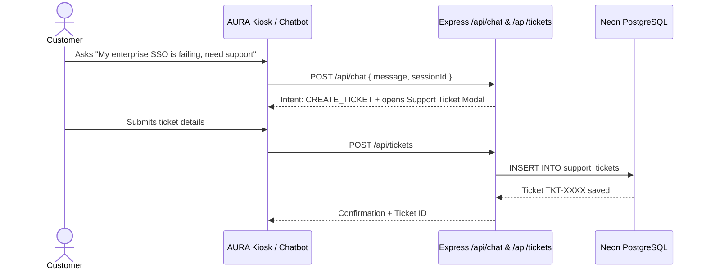
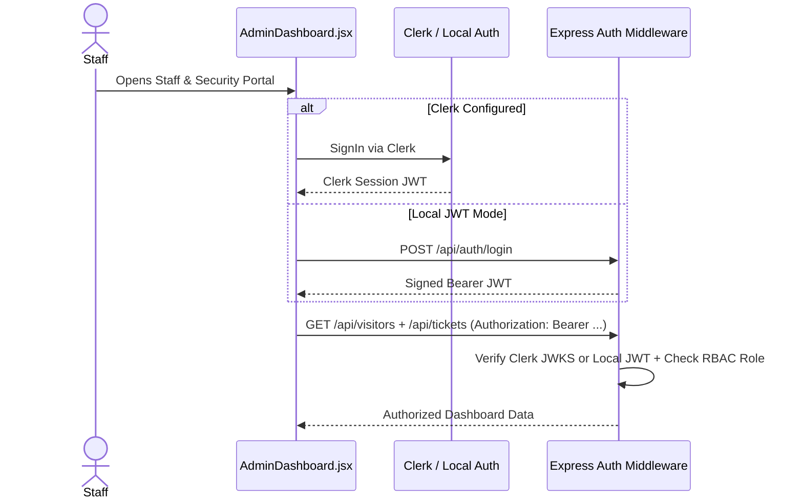

# User Flows (`USER_FLOWS.md`)

## 1. AI Customer Super Chatbot & Support Ticket Flow

```mermaid
sequenceDiagram
    actor Customer
    participant UI as AURA Kiosk / Chatbot
    participant API as Express /api/chat & /api/tickets
    participant DB as Neon PostgreSQL

    Customer->>UI: Asks "My enterprise SSO is failing, need support"
    UI->>API: POST /api/chat { message, sessionId }
    API-->>UI: Intent: CREATE_TICKET + opens Support Ticket Modal
    Customer->>UI: Submits ticket details
    UI->>API: POST /api/tickets
    API->>DB: INSERT INTO support_tickets
    DB-->>API: Ticket TKT-XXXX saved
    API-->>UI: Confirmation + Ticket ID
```

## 2. Clerk / JWT Staff Authentication Flow

```mermaid
sequenceDiagram
    actor Staff
    participant Portal as AdminDashboard.jsx
    participant Clerk as Clerk / Local Auth
    participant API as Express Auth Middleware

    Staff->>Portal: Opens Staff & Security Portal
    alt Clerk Configured
        Portal->>Clerk: SignIn via Clerk
        Clerk-->>Portal: Clerk Session JWT
    else Local JWT Mode
        Portal->>API: POST /api/auth/login
        API-->>Portal: Signed Bearer JWT
    end
    Portal->>API: GET /api/visitors + /api/tickets (Authorization: Bearer ...)
    API->>API: Verify Clerk JWKS or Local JWT + Check RBAC Role
    API-->>Portal: Authorized Dashboard Data
```
